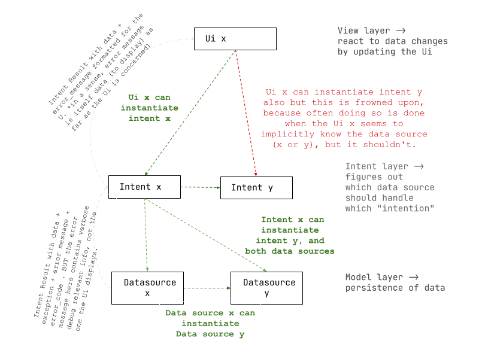

# Contributing

Contributions are welcome, and they are greatly appreciated! Every
little bit helps, and credit will always be given.

You can contribute in many ways:

# Types of Contributions

## Report Bugs

Report bugs at <https://github.com/tuttle-dev/tuttle/issues>.

If you are reporting a bug, please include:

-   Your operating system name and version.
-   Any details about your local setup that might be helpful in
    troubleshooting.
-   Detailed steps to reproduce the bug.

## Fix Bugs

Look through the GitHub issues for bugs. Anything tagged with "bug"
and "help wanted" is open to whoever wants to implement it.

## Implement Features

Look through the GitHub issues for features. Anything tagged with
"enhancement" and "help wanted" is open to whoever wants to
implement it.

## Write Documentation

Tuttle could always use more documentation, whether as part of the
official docs, in docstrings, or even on the web in blog posts,
articles, and such.

## Submit Feedback

The best way to send feedback is to file an issue at
<https://github.com/tuttle-dev/tuttle/issues>.

If you are proposing a feature:

-   Explain in detail how it would work.
-   Keep the scope as narrow as possible, to make it easier to
    implement.
-   Remember that this is a volunteer-driven project, and that
    contributions are welcome :)

## AI-Assisted Contributions

AI tools are welcome for drafting code and documentation, but contributors remain fully responsible for what they submit.

Contributors are expected to:

- Understand all code and documentation they submit.
- Verify that AI-generated suggestions are correct.
- Test changes before opening a pull request.
- Be able to explain the reasoning behind their changes during review.

Pull requests that consist primarily of unreviewed AI-generated content may be rejected. The contributor, not the AI tool, is responsible for the quality and correctness of the submission.

When AI assistance was substantial, please mention it in the pull request description.


# Get Started!

Ready to contribute? Here's how to set up Tuttle for
local development.

## Prerequisites

-   Python 3.12 or newer
-   [uv](https://docs.astral.sh/uv/) (recommended) or pip
-   Node.js 22 or newer

## Development Setup

1.  Fork the repo on GitHub.

2.  Clone your fork locally:

    ```shell
    git clone git@github.com:your_name_here/tuttle.git
    cd tuttle/
    ```

3.  Install the Python core dependencies with [uv](https://docs.astral.sh/uv/):

    ```shell
    uv sync
    ```

4.  Install the Electron UI dependencies:

    ```shell
    cd ui
    npm install
    cd ..
    ```

5.  Create a branch for local development:

    ```shell
    git checkout -b name-of-your-bugfix-or-feature
    ```

    Now you can make your changes locally.


    **Install the pre-commit hooks before making your first commit to ensure that you match the code style**:

    ```shell
    pre-commit install
    ```

6.  If you haven't done so already, install and/or activate
    [pyright](https://github.com/microsoft/pyright).
    The "basic" level should suffice and help you to avoid type errors.
    If you are getting a type error, ask yourself:
    Can this occur at runtime?

    No -> add `#type: ignore` to the end of the line

    Yes -> ensure that it doesn't, e.g. by using an `assert` statement

    Oftentimes, type errors indicate bad design,
    so keep refactoring in mind as a third option.

7.  When you're done making changes, check that your changes pass
    the tests:

    ```shell
    uv run pytest
    ```


8.  Commit your changes and push your branch to GitHub:

    ```shell
    git add .
    git commit -m "Your detailed description of your changes."
    git push origin name-of-your-bugfix-or-feature
    ```

9.  Submit a pull request through the GitHub website.

## Running the App

Start the Electron app in development mode. The Python RPC sidecar is
spawned automatically:

```shell
cd ui
npm run dev
```

## Building for Production

```shell
just build
```

This builds the Python sidecar with PyInstaller and packages the Electron
app with electron-builder.

# Pull Request Guidelines

Before you submit a pull request, check that it meets these guidelines:

1.  The pull request should include tests.
2.  If the pull request adds functionality, the docs should be updated.
    Put your new functionality into a function with a docstring.
3.  The pull request should work for Python 3.12 and 3.13.

# Tips

To run a subset of tests:

```shell
uv run pytest tuttle_tests/test_model.py
```

To run a specific test:

```shell
uv run pytest tuttle_tests/test_model.py::TestContract::test_valid_instantiation
```

# Deploying

Make sure all your changes are committed. Then run:

```shell
bump2version patch  # possible: major / minor / patch
git push
git push --tags
```


# Architecture

Tuttle is a desktop application with a Python core and an Electron UI shell.

- **Python core** (`tuttle/`): Business logic, data models, invoicing, tax calculations, and a JSON-RPC server (`tuttle/rpc_server.py`) that exposes the core as a stdio service.
- **Electron shell** (`ui/`): React + TypeScript desktop UI that communicates with the Python core via JSON-RPC over stdio.

### Architecture Notes

**The View**

- builds UI,
- reacts to data changes (by updating the UI)
- listens for events and forwards them to the Intent

**The Intent**

- receives events
- if some data is affected by the event, figure out which data source corresponds to that data
- transforms the event data to the data format required by the data source
- transform returned data source data to the data format required by the UI
- else, no data is affected by the event, handle the event (often using a util class).
- an example of this is sending invoices by mail.

**The Model (a.k.a data layer)**

- defines the entity
- define the entity source (file, remote API, local database, in-memory cache, etc)
- if a relational database is used, define the entity's relationship to other entities
- maintain the integrity of that relation (conflict strategies for insert operations are defined here, and integrity errors are thrown here, for example)
- defines classes that manipulate this source (open, read, write, ....)


As you go outer in layers (the outmost layer is the UI, the innermost is the data layer), communication can occur downward across layers, and horizontally, BUT a layer cannot skip the layer directly below it. This is to say:

* Data sources can communicate with each other. Thus `ClientDatasource.delete_client` can call `ContractDatasource.get_contract` for example.

* Intents can communicate with each other, and with any data source. Thus `ClientIntent` can call `ContractIntent` or `ContractDatasource` for example.
The UI can communicate with any intent (though often the UI is tied to only a single intent, and the intent can instead call the "other" intent). But it cannot communicate with a data source -- this would violate the do-not-skip-layers rule.
An inner layer cannot have a dependency on the layer above it. Thus an intent cannot instantiate a UI class, and a data source cannot instantiate an Intent class.


