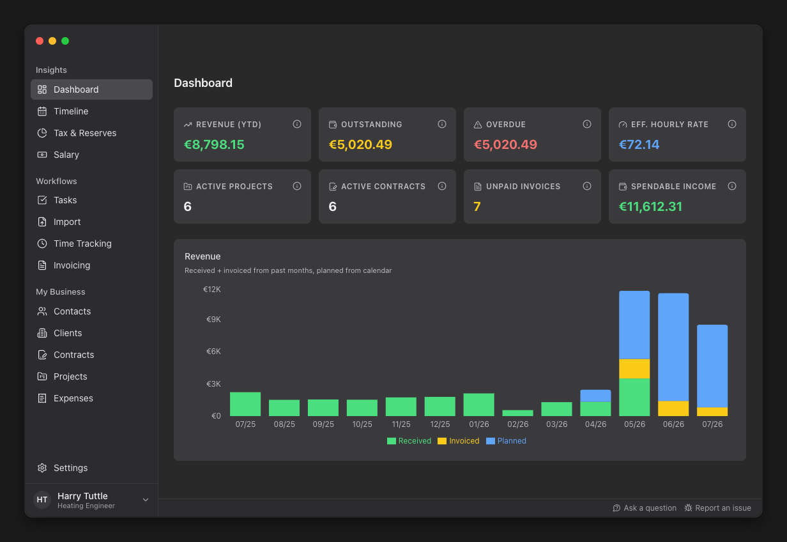
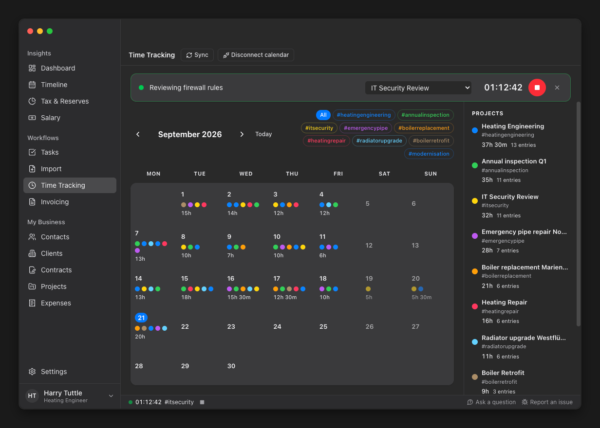
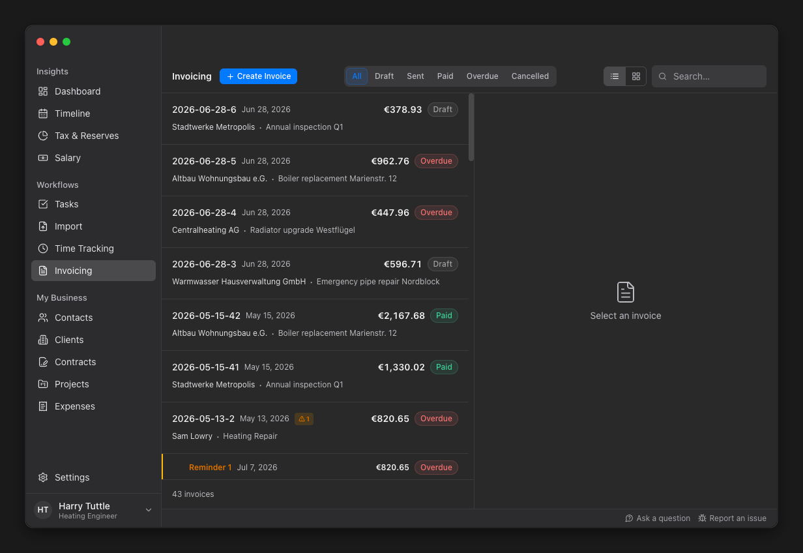
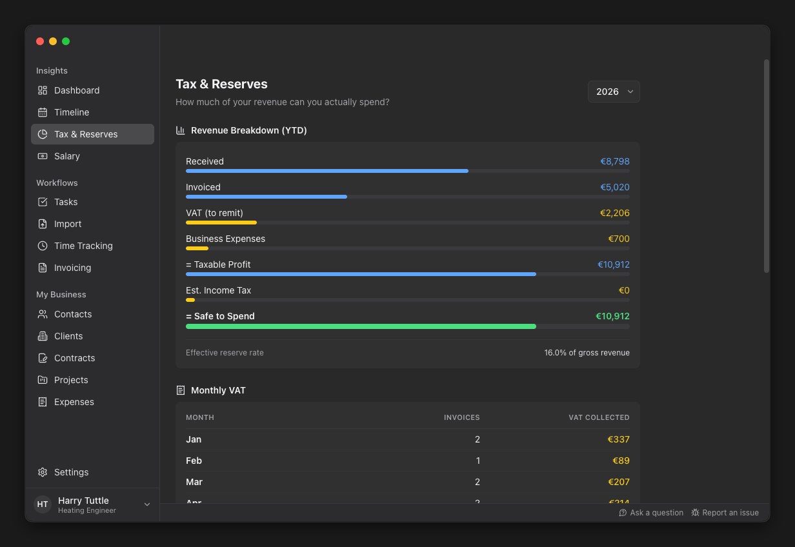
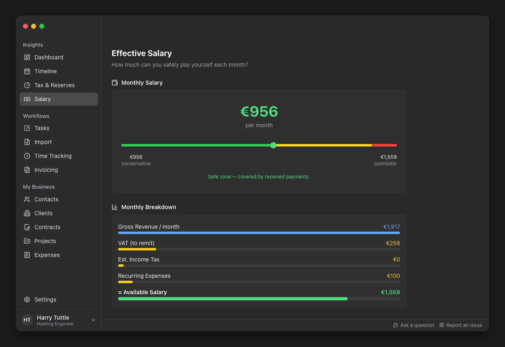
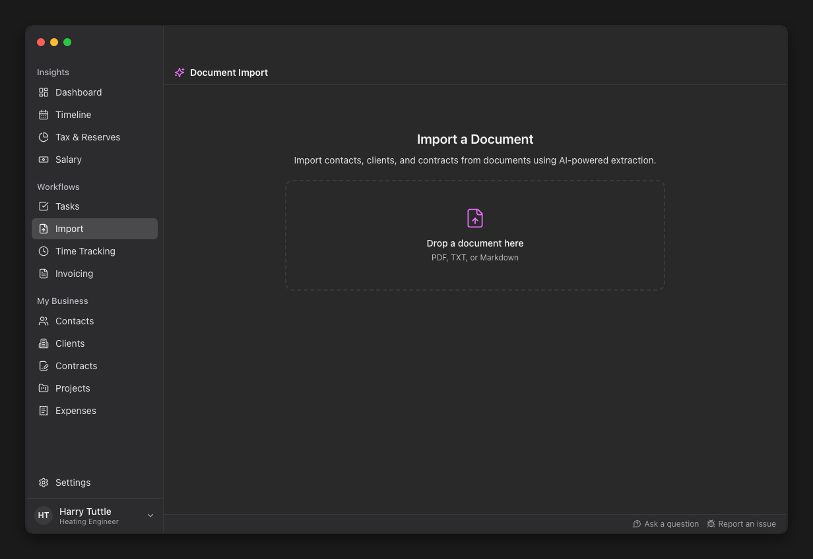

 

  <h1>Tuttle</h1>

  
  
  
  

  
<b>Time and money management for freelancers</b>

  

    <blockquote align="left">
    HARRY TUTTLE: Bloody paperwork. Huh!
     
    SAM LOWRY: I suppose one has to expect a certain amount.
     
    HARRY TUTTLE: Why? I came into this game for the action, the excitement. Go anywhere, travel light, get in, get out, wherever there's trouble, a man alone.
    </blockquote>
     
  

  

    
    
    
  

  

    

## What Tuttle Does

Tuttle is a desktop app that takes the paperwork off your plate as a freelancer:

- **Track your time** — with a timer, by hand, or imported from your calendar.
- **Invoice** — from tracked time or fixed-price milestones, as Factur-X / ZUGFeRD e-invoices.
- **Import documents with AI** — extract data from existing invoices and contracts.
- **See your business at a glance** — revenue, outstanding invoices, budgets, goals.
- **Know what you can spend** — tax reserves, expenses, and your effective salary.
- **Keep your data private** — stored locally, no account, no central server.

## Mission Statement

More and more professionals choose solo self-employment for the freedom and creative possibilities. But with freelancing come side activities that few enjoy: invoicing, tax planning, client management, time tracking -- each typically handled by a separate tool or spreadsheet.

Tuttle brings all of this into one place. It is a desktop app tailored to solo freelancers that automates the paperwork and gives you more time to do the work you love. Sensitive financial data is processed locally on your device without central data collection -- your business data is none of our business.

## Features

### Dashboard

Revenue, outstanding invoices, project budgets, forecasts, and progress towards your financial goals.

### Time Tracking

Start a timer on a project, log entries by hand, or import from your calendar or time-tracking tool.

### Invoicing

Invoices and timesheets from tracked time, manual quantities, or fixed-price contracts with deposit and final invoices. Payment reminders, multiple currencies, and a SEPA QR code. Every invoice is a **Factur-X / ZUGFeRD** e-invoice (XRechnung optional), exported to PDF and sent by email.

### Clients, Contracts & Projects

Rates, billing cycles, payment schedules and bank accounts per contract; time budgets per project.

### Tax & Reserves

How much of your revenue goes to VAT and income tax, and what is left to spend.

### Salary & Expenses

What you can safely pay yourself each month, after taxes and recurring expenses.

### Timeline & Tasks

Key events in chronological order, and a to-do list of what needs your attention.

### AI Document Import

Drop an invoice or contract PDF and Tuttle extracts the data — with a local model via Ollama, or any OpenAI-compatible provider.

## Getting Started

Tuttle is a desktop application for Windows, macOS, and Linux.

1. Go to the [Releases page](https://github.com/tuttle-dev/tuttle/releases) and download the build for your operating system.
2. Install and launch it like any other desktop application.

Your data is stored locally on your device — there is no account to create and no central server involved.

Want to build from source, run the app in development mode, or contribute? See the [Contributing guide](https://github.com/tuttle-dev/tuttle/blob/main/CONTRIBUTING.md).

## Contributing

Your contributions are welcome. The [Contributing guide (CONTRIBUTING.md)](https://github.com/tuttle-dev/tuttle/blob/main/CONTRIBUTING.md) covers the development setup, how to run the app and tests, and the pull request workflow.

## Acknowledgements

This project has received funding by the [Prototype Fund](https://prototypefund.de) in 2022.

## License

Copyright 2022-2026 Christian Staudt and contributors. Licensed under the [GNU General Public License v3.0](LICENSE).
